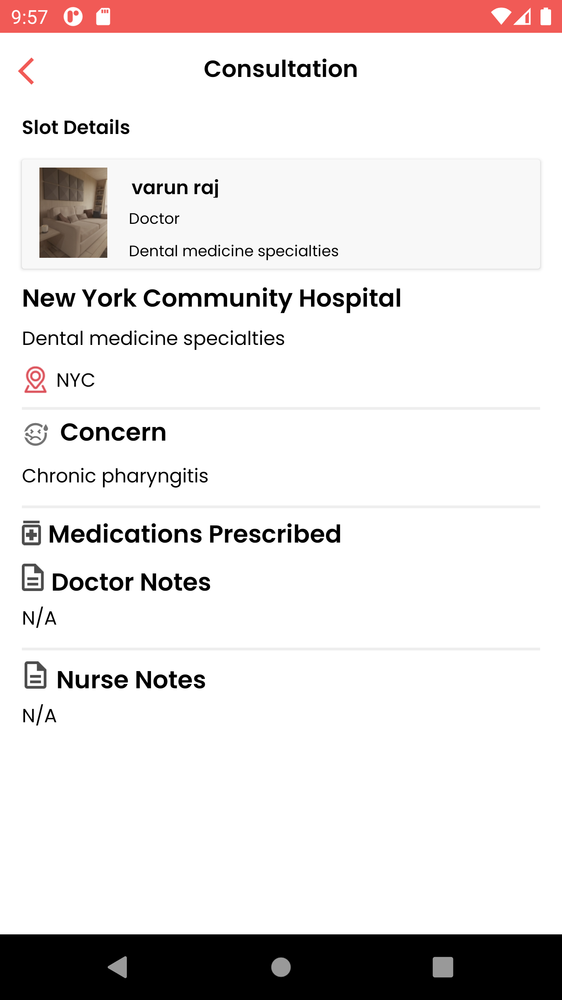

# Healthcare Solution

The solution showcases how MongoDB Realm and MongoDB Atlas can help address key usecases for the healthcare space using Flexible Sync & [FHIR](https://www.hl7.org/fhir/overview.html).

## Doctor/Nurse App

### Signup
This app will collect below mentioned details for signup process
 - First,Last Name
 - Email,Password
 - Role,Gender and DOB
 - Specialisation only for the Doctor
 - Organizations(Hospitals) 
 
### Login using email ID and Password
* Based on user type, different screens/editable fields will be shown for a Doctor and Nurse

### Practitioner(Doctor/Nurse) User
- The Practitioner can View Organization(Hospitals) list
- The Practitioner can Select the hospital from the hospital list and view the list of Appointment created by patient
- The Practitioner can searcn the appointments
- The Practitioner can apply the filter for today,yesterday and tomorrow
- The Practitioner can Select the Appointment and View the patient basic information and illness and medication taken already details
- The Practitioner(Doctor) can update the Medication , Notes and the Nurse allocation for the appointment
- The Practitioner(Nurse) can update the Notes
- The Practitioner can update the profile info and profile pic also

## Patient App

### Signup
This app will collect below mentioned details for signup process
 - First,Last Name
 - Email,Password
 - Role,Gender and DOB
 - Add illness and medication details
 - Organizations(Hospitals) 

### Patient User
- The Patient can View Organization(Hospitals) list
- The Patient can Select the hospital from the hospital list then view the list of Doctors who are associated with the hospital
- The Patient can select any one of the Doctor and can view thair profile info and specialization
- The Patient can Select the Date,slot and illness from create appointment screen and can create an appointment
- The Patient can view the Consultation and Doctor Medication,Doctor Notes and Nurse Notes
- The Patient can add more illness from menu
- The Patient can view thair profile info

## Patient Screenshots

<table>
 
  <tr>
    <td></td>
    <td></td>
    <td></td>
  </tr>

   <tr>
    <td></td>
    <td></td>
  </tr>

   <tr>
    <td></td>
    <td></td>
  </tr>

   <tr>
    <td></td>
    <td></td>
  </tr>
 </table>

## Doctor/Nurse Screenshots

<table>
 
  <tr>
    <td></td>
    <td></td>
    <td></td>
  </tr>

   <tr>
    <td></td>
    <td></td>
  </tr>

   <tr>
    <td></td>
  </tr>
 </table>
