# Store manager app
 This app demonstrates a usecase of logistics for product movement, App will be used by the store admin for creating job to move product from store to store. The delivery user uses the app to process the job while the product movement happens.

## Features:

## Login using email ID and Password
* Based on user type, different screens will be shown for a Store user and Delivery user

## Store Admin User
- View Store Inventory of Products
- Product Name, SKU number, Image, Product Description, Price, Total Quantity Available
- Local Alert if Quantity goes below 5 units (The 5 units is hardcoded, can be changed to any number)
- Search by Product Name within the Store inventory
- Create a delivery job
- Select Pickup Store and Address, Products and quantities, Destination Store and Address, Pickup - Date and Time
- Assign Delivery User
- Edit Delivery Job
- Reassign a new Delivery user if only in Open state.
- View Delivery jobs
- Open, In-Progress, Completed

## Delivery User
- View list of delivery jobs
- View Open (Assigned to the user)
- View details of the delivery job
- Pickup Store and Address, Products and quantities, Destination Store and Address, Pickup Date and Time
- Option to update the delivery job status to
- In-Progress
- Completed (Capture Date and Time of completion)

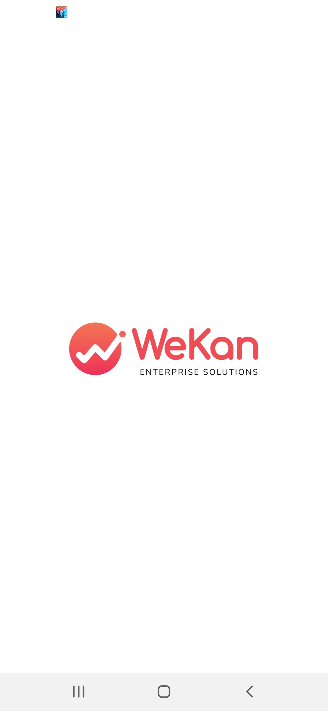
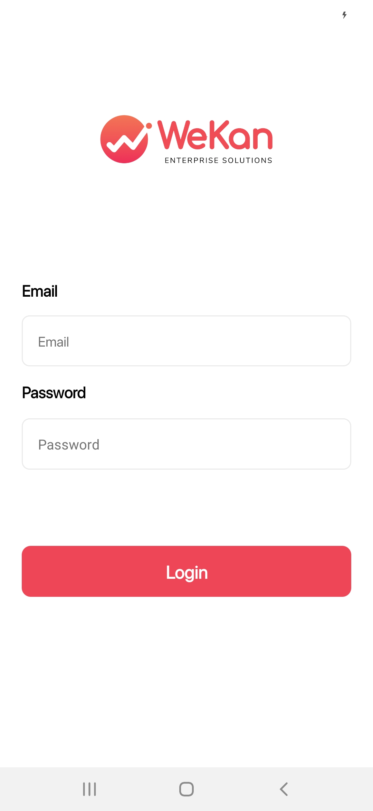
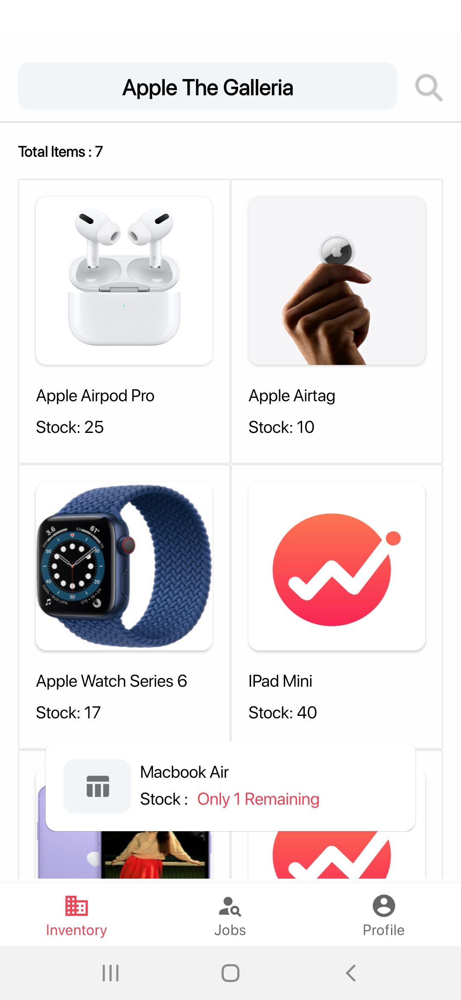
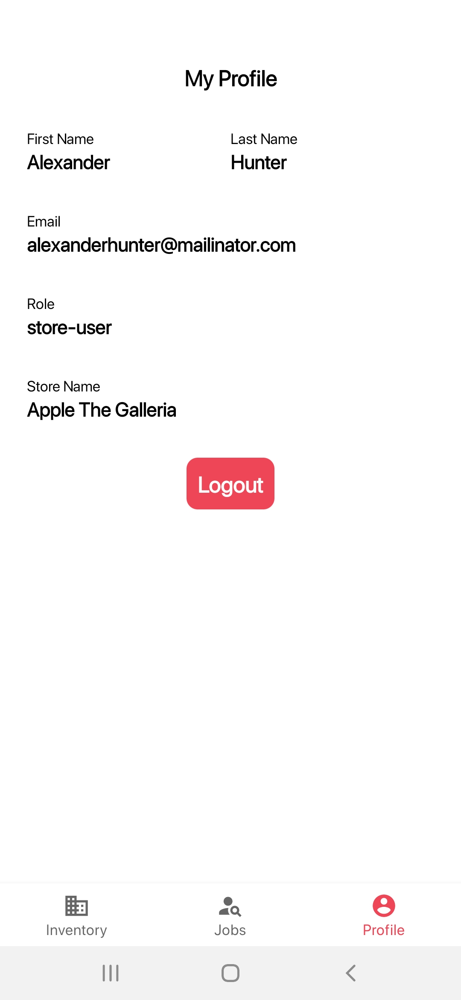
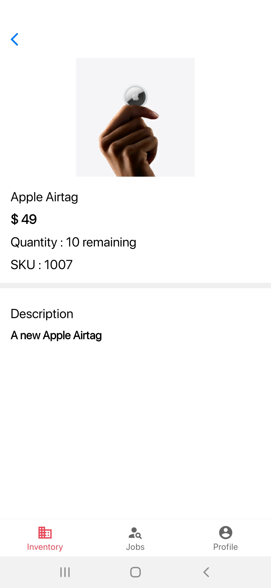
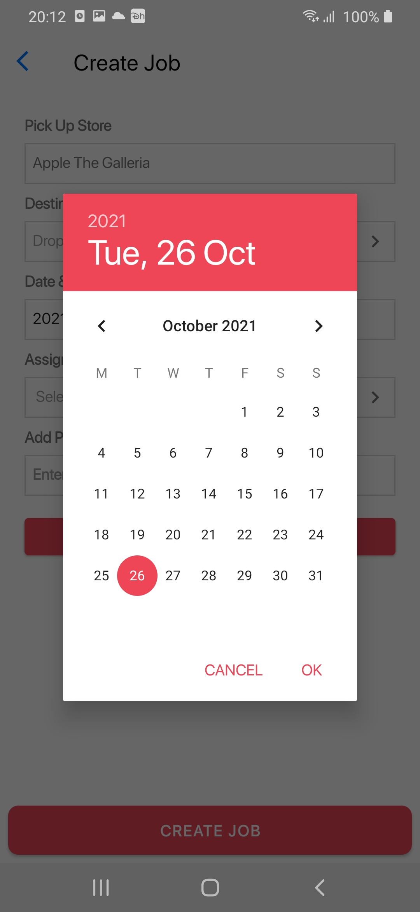
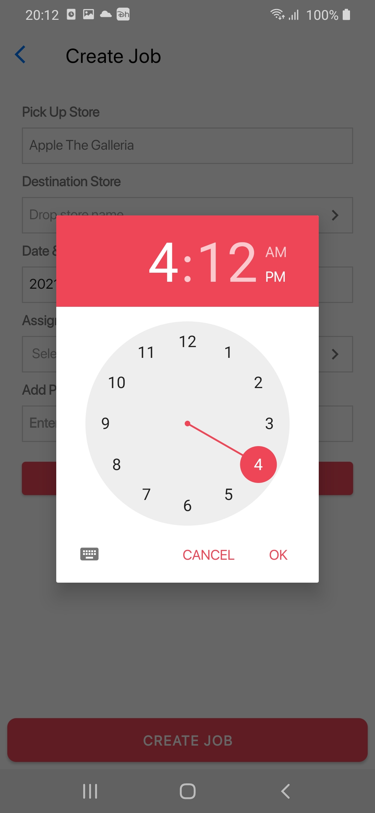
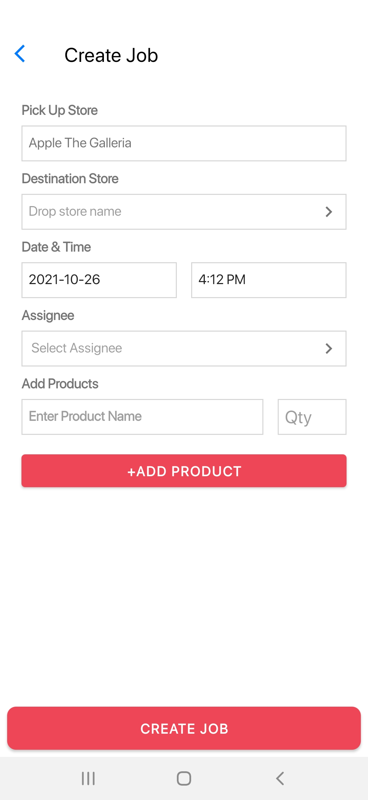
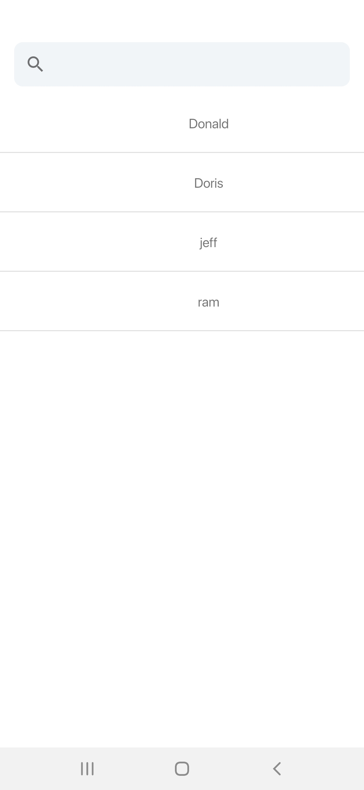
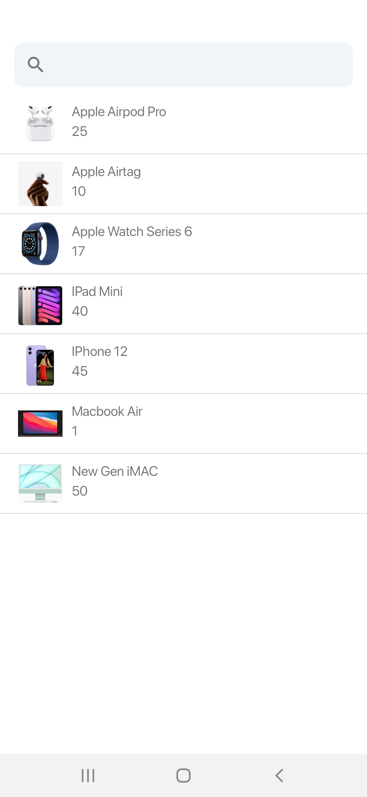
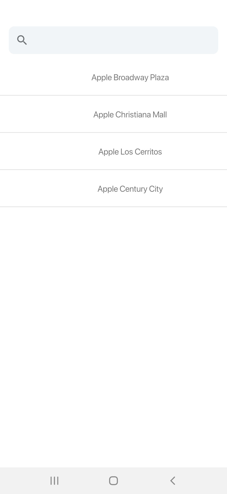
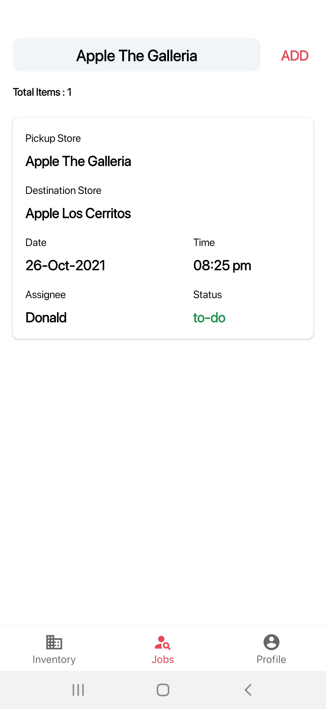
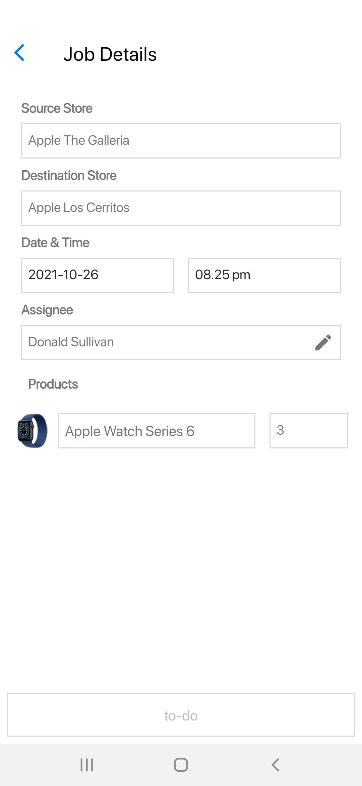
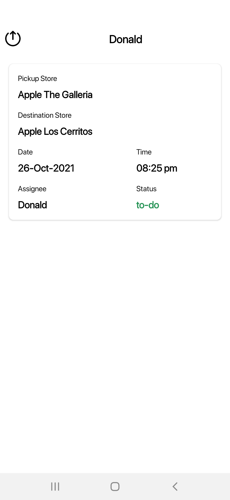
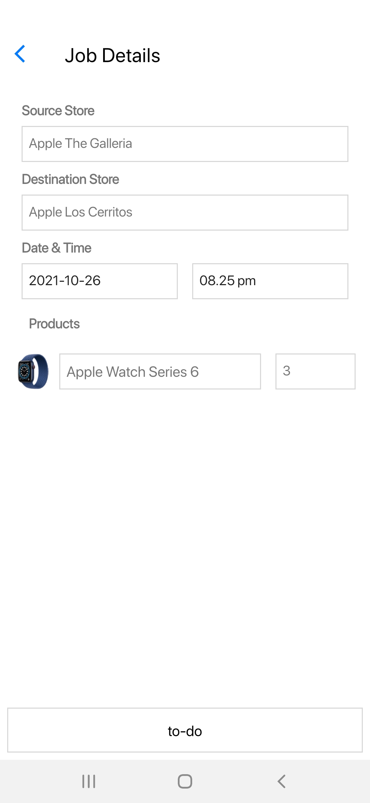
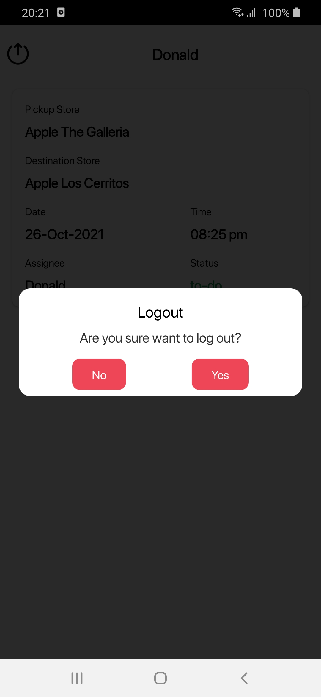