# Retail app
This app demonstrates the delivery operations and inventory management across outlets of a retail store chain. 
App users will be the store managers and delivery users.

Note: Replace the google places api key in AppConfig.swift for address search feature.

## Features:
## SignUp
- First Name, Last Name, Email, Password and User type (Store Manager or Delivery User)
- Select the stores that will be managed by this Store User
- Based on user type, users will be directed to respective dashboards
## Login using email ID and Password
* All users login using their email and password to navigate to their dashboard.

## Store Manager User
- Lists the products/inventory of the active store.
- Swap to any store managed by the user.
- View inventory info - Product Name, description, SKU number, Image, Price, Total Quantity Available
- Local Alert if Quantity goes below 5 units (The 5 units is hardcoded, can be changed to any number)
- Search by Product Name within the Store inventory
- Create delivery jobs by selecting informetion like Pickup Store, Address, Products and quantities, Destination Store and Address, Pickup Date and Time
- Edit Delivery Job, Assign a Delivery User to job
- Option to Reassign another delivery user, if job is still in Open state.
- Create orders for store pickup and home deliveries.
- Options to Edit and Delete Order
- Create delivery jobs for the Orders by assigning a Delivery User
- View User profile and logout

## Delivery User
- View To-Do, In-Progress, and Completed jobs
- View details of the delivery jobs
- Option to update the delivery job status to in-progress and done.

# Screens

## SignUp screen  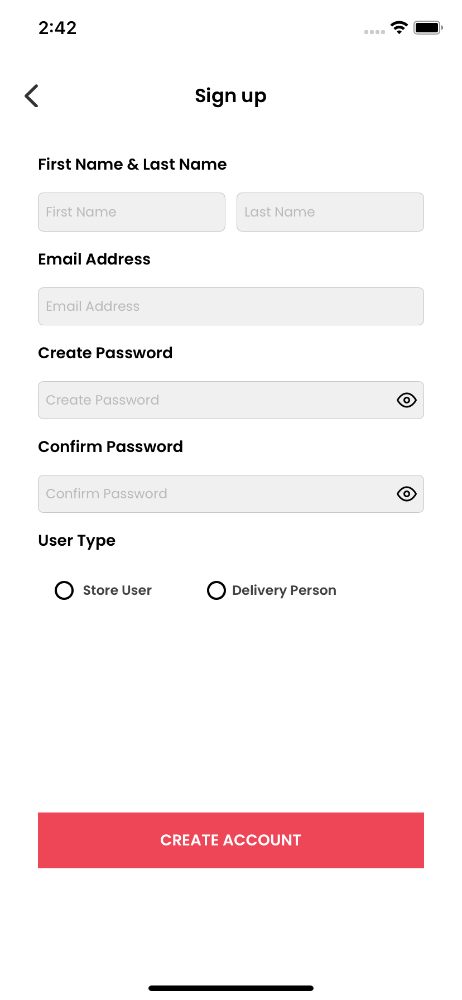
## Store Admin Dashboard screen  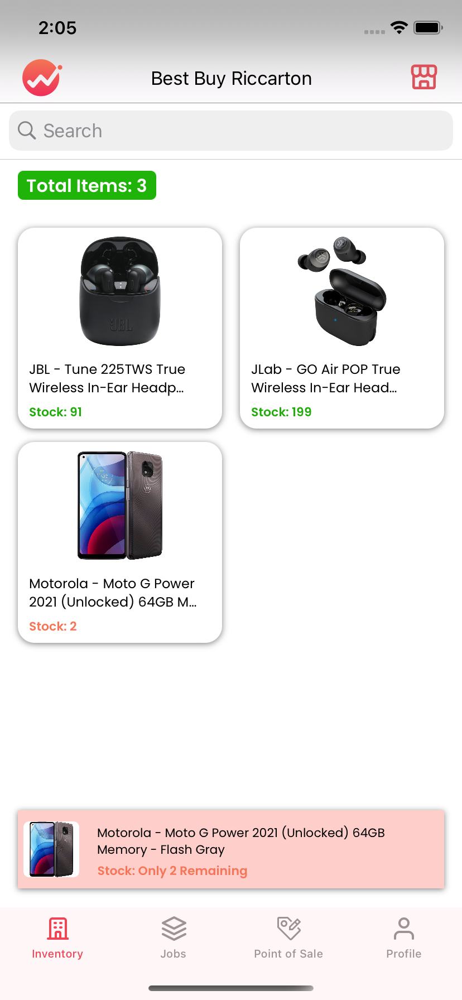
## Product Details screen  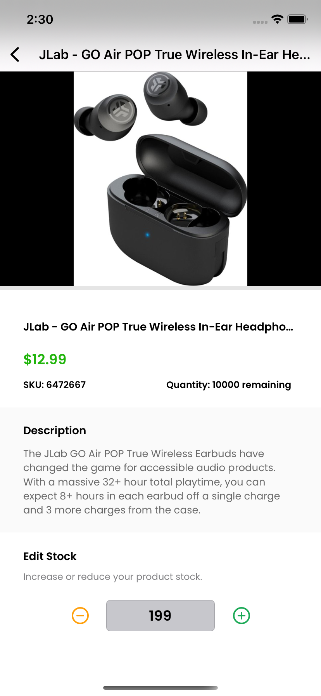
## Swap Store screen  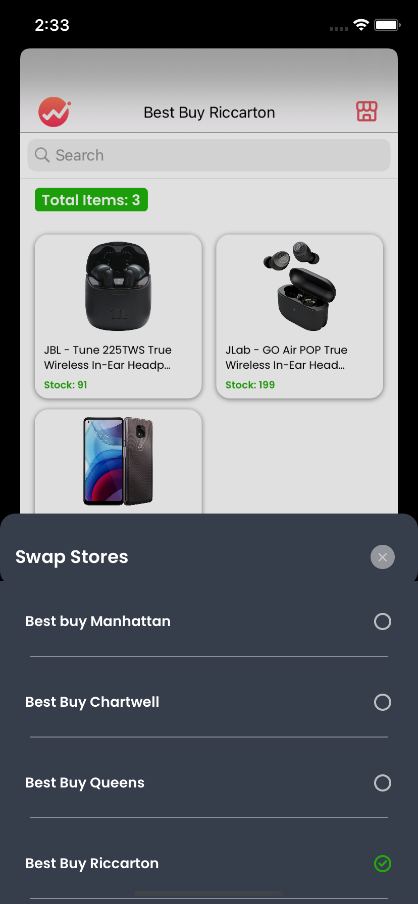
## Create Job screen  
## Jobs List screen  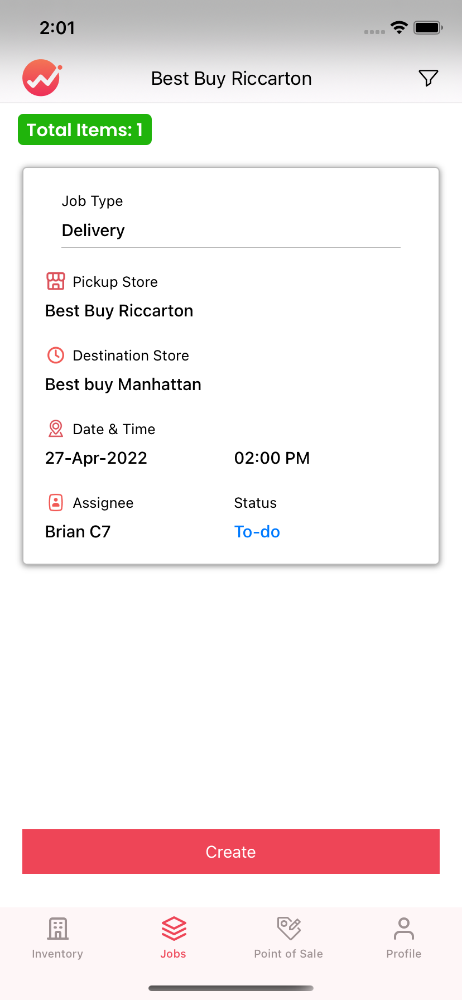
## Create Order screen  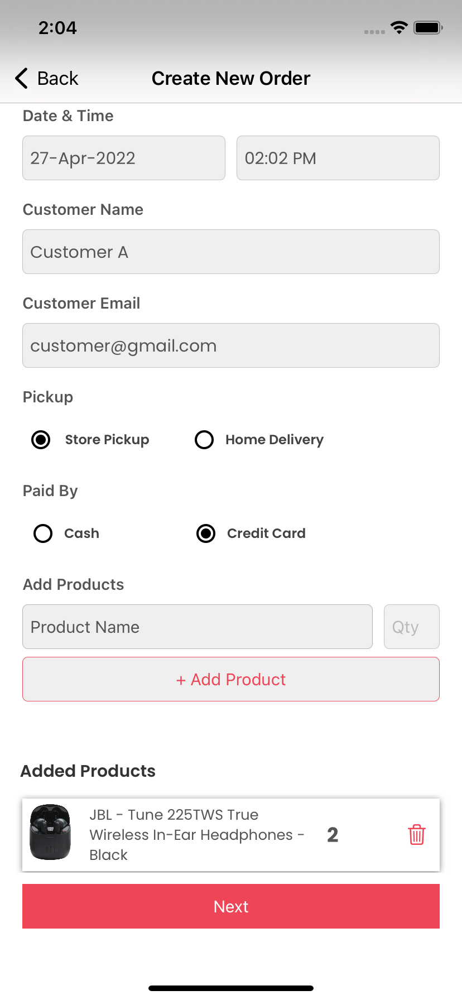
## Order summary screen  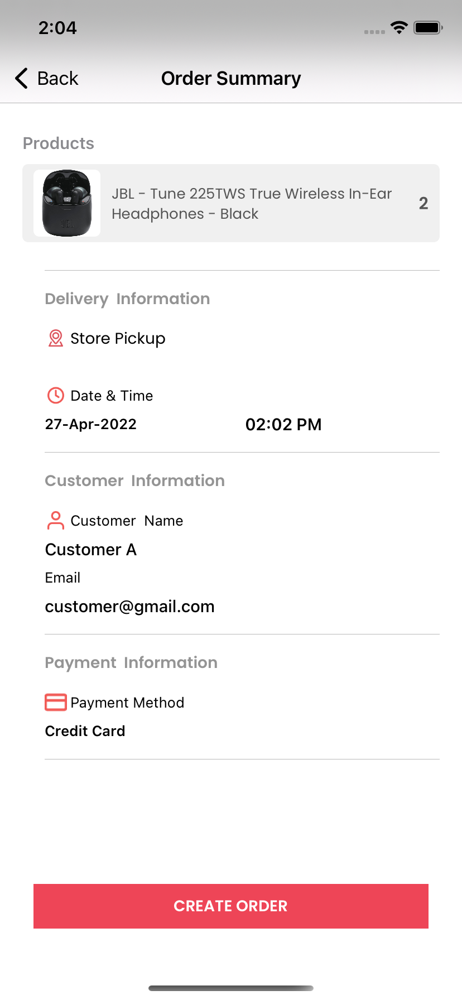
## Orders List screen  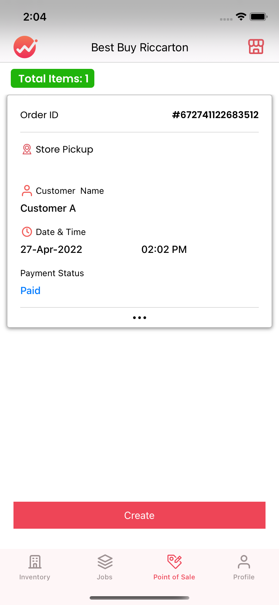
## Filter Job screen  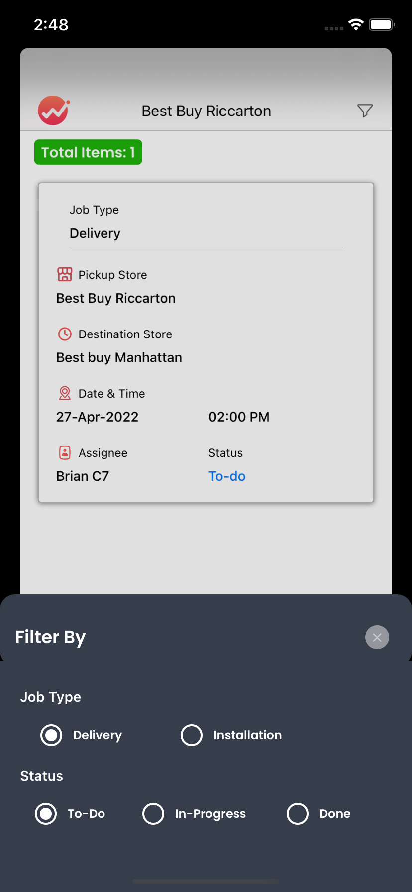
## Admin profile screen  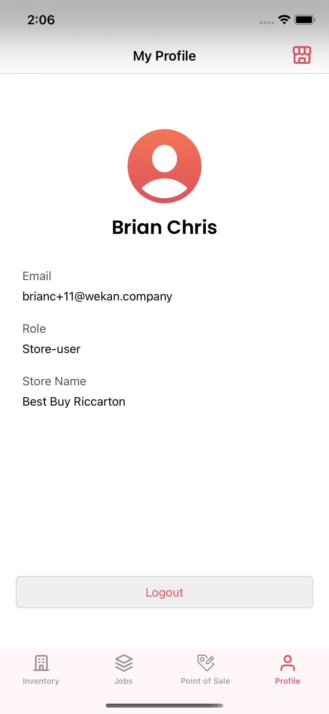
## Delivery User TO-Do list screen  
## Delivery User Job details screen  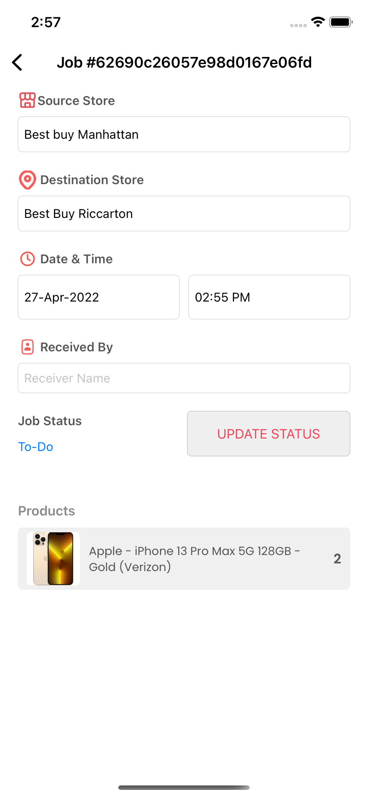
## Delivery User Update job status screen  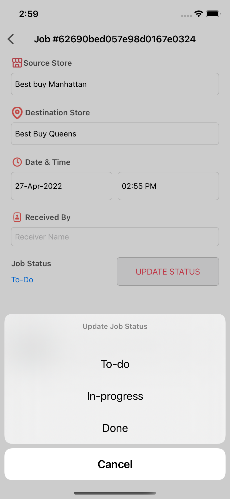
## Delivery User Completed job screen  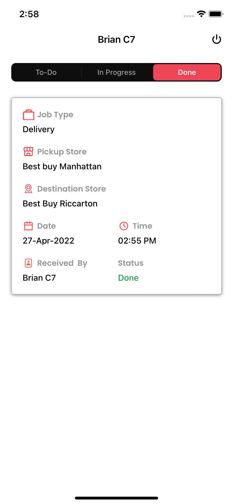

